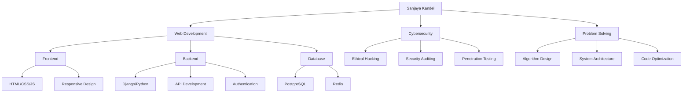

<div align="center">

# 🚀 Sanjaya Kandel
### Full-Stack Web Developer | Cybersecurity Enthusiast | BSc.IT Graduate


<!-- [](https://linkedin.com/in/sanjayakandel) -->
[](https://github.com/SanjayaKandel)
[](mailto:sanjaykc375@gmail.com)
[](https://sanjayakandel.com.np/)
[](https://www.facebook.com/SpikeyHoraa)
[](https://www.instagram.com/sanjay_kshetri_17/)

</div>

---

## 🌟 About Me


```python
class SanjayaKandel:
    def __init__(self):
        self.name = "Sanjaya Kandel"
        self.location = "Baglung District, Nepal 🇳🇵"
        self.education = "BSc.IT Graduate"
        self.role = "Full-Stack Web Developer"
        self.interests = ["Web Development", "Cybersecurity", "AI/ML"]
        self.currently_learning = ["Advanced Django", "Ethical Hacking", "Cloud Security"]
        
    def say_hi(self):
        print("Thanks for dropping by! Let's build something amazing together 🚀")

me = SanjayaKandel()
me.say_hi()
```

🎓 **Fresh BSc.IT Graduate** from Baglung District, Nepal  
💻 **Experienced Web Developer** with 3 months Django full-stack internship  
🔒 **Certified Cybersecurity Professional** - Cisco Cybersecurity Essentials  
🌍 **Aspiring Graduate Student** seeking Master's in Cybersecurity abroad  
🌱 **Continuous Learner** always adapting to new technologies  

---

## 🛠️ Tech Stack & Skills

<div align="center">

### 🚀 Languages & Frameworks


### 🗄️ Databases & Tools


### 🔒 Security & DevOps


### 🏅 Certifications


</div>

---

## 📊 GitHub Analytics

<div align="center">
  
  
</div>

<div align="center">
  
</div>

<div align="center">
  
</div>

---

## 🎯 Featured Projects

<div align="center">

### 🌐 Chautari - Community-Based Social Platform
[](https://github.com/SanjayaKandel/Chautari-A-community-based-social-platform)

</div>

**🚀 Key Features:**
- 🔐 **Advanced Authentication System** with OTP verification
- 👥 **Circle-based Communities** with role management
- 💬 **Real-time Chat & Video Calling** 
- 📱 **Responsive Design** with modern UI/UX
- 🛡️ **Security Features** including NSFW detection
- 📊 **Admin Dashboard** with analytics

**🛠️ Tech Stack:** Django, PostgreSQL, Redis, WebRTC, Django Channels

---

## 🎨 Skills Visualization

<div align="center">



</div>

---

## 🏆 Achievements & Certifications

<div align="center">

| 🎓 **Education** | 🏅 **Certifications** | 💼 **Experience** |
|:---:|:---:|:---:|
| BSc.IT Graduate | Cisco Cybersecurity Essentials | 3 Months Django Internship |
| Baglung District, Nepal 🇳🇵 | Web Development Certified | Full-Stack Development |
| Seeking Master's Abroad | Python Programming | 5+ Projects Completed |

</div>

---

## 📈 Contribution Graph

<div align="center">
  
</div>

---

## 🎯 Current Focus

<div align="center">

```yaml
Current_Focus:
  - name: "Master's Degree Application"
    status: "Active"
    focus: ["Cybersecurity Programs Abroad", "University Research", "Application Prep"]
  
  - name: "Advanced Cybersecurity Skills"
    status: "In Progress"
    focus: ["Building on Cisco Certification", "Ethical Hacking", "Penetration Testing"]
  
  - name: "Professional Development"
    status: "Ongoing"
    focus: ["Django Expertise from Internship", "Full-Stack Projects", "Open Source"]

Recent_Achievements:
  - "✅ Cisco Cybersecurity Essentials Certificate"
  - "✅ 3 Months Django Full-Stack Internship Completed"
  - "✅ Chautari Social Platform - Major Project"
  - "🎯 Researching Master's Programs in Cybersecurity"

Next_Goals_2025:
  - "🎓 Secure admission to Master's program abroad"
  - "🔒 Advanced Cybersecurity Certifications (CEH/CISSP)"
  - "☁️ Cloud Security Specialization"
  - "🌐 Contribute to Open Source Security Projects"
```

</div>

---

## 🤝 Let's Connect!

<div align="center">

### 💬 I'm always open to discussing:
- 🌐 **Web Development** projects and best practices
- 🔒 **Cybersecurity** trends and methodologies  
- 🚀 **Tech Innovation** and emerging technologies
- 🤝 **Collaboration** opportunities


### 📫 Reach out to me:
[](https://github.com/SanjayaKandel)
[](mailto:sanjaykc375@gmail.com)
[](https://sanjayakandel.github.io)
[](https://facebook.com/sanjayakandel)
[](https://instagram.com/sanjayakandel)

</div>

---

<div align="center">

### 🌟 "Code is like humor. When you have to explain it, it's bad." - Cory House

**Thanks for visiting my profile! Let's build something amazing together! 🚀**


</div>
